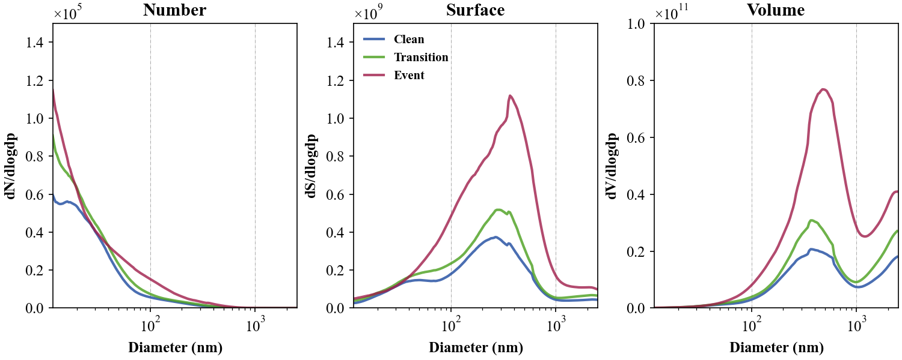
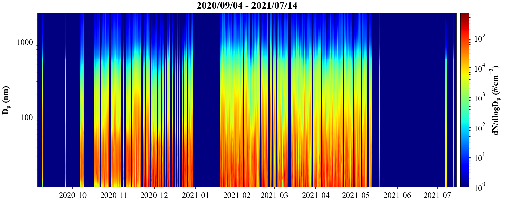
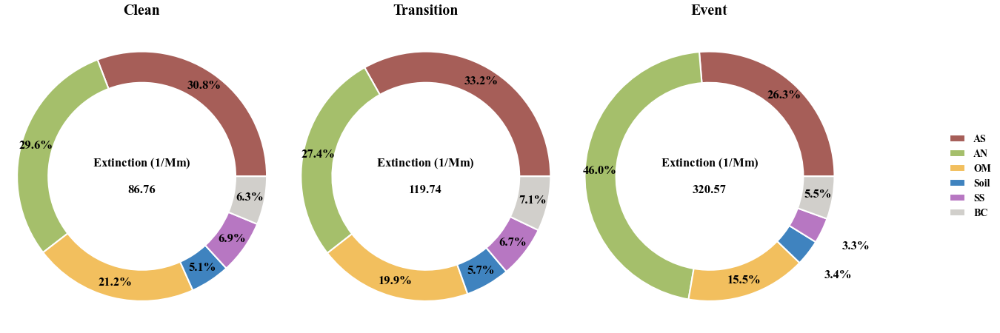

## 
DataPlot for Aerosol Science

  
  
  
  

> [!IMPORTANT]\
> Important

> [!NOTE]\
> The provided code comprises a versatile toolkit for data 
> visualization built on the Python programming language. 

  
  
  
  
  
  
  
  
  
  
  
  
  
  
  

## 
Particle Size Distribution

|                     PSD                      |                    Heatmap                    |                Three_dimension                |
|:--------------------------------------------:|:---------------------------------------------:|:---------------------------------------------:|
|               |  |            |
 

## 
IMPROVE

|                    Donuts                    |                    BarPlot                    |           Mutiply Linear Regression           |
|:--------------------------------------------:|:---------------------------------------------:|:---------------------------------------------:|
|  |  |  |

## 
Usage

To install the package, run

    $ git clone https://github.com/Alex870521/DataPlot.git

## 
Related Dependencies

* [PyMieScatt](https://github.com/bsumlin/PyMieScatt.git)
* [py-smps](https://github.com/quant-aq/py-smps.git)

## 
Contact

For bug reports and feature requests please visit [GitHub Issues](https://github.com/Alex870521/DataPlot/issues).

  
  
  
  
  
  
  
  
  
  
  
  
  
  
  

