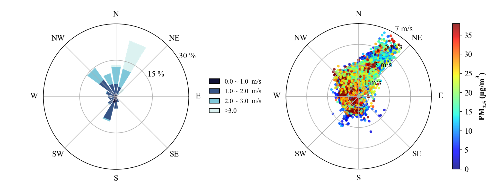
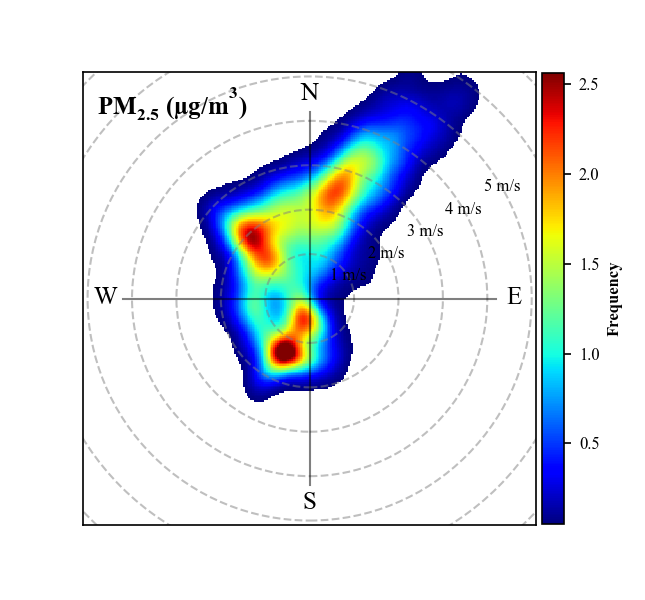
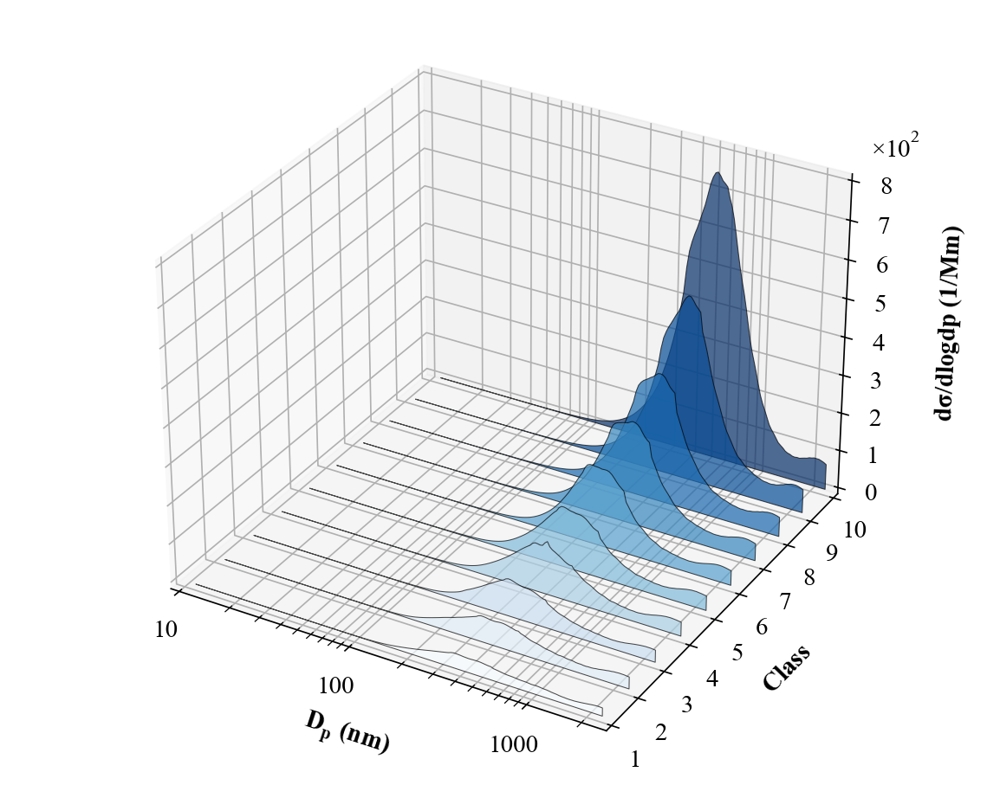
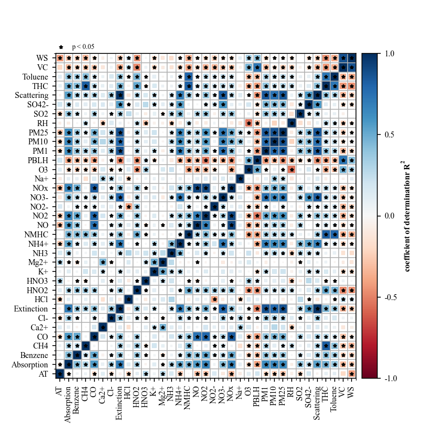
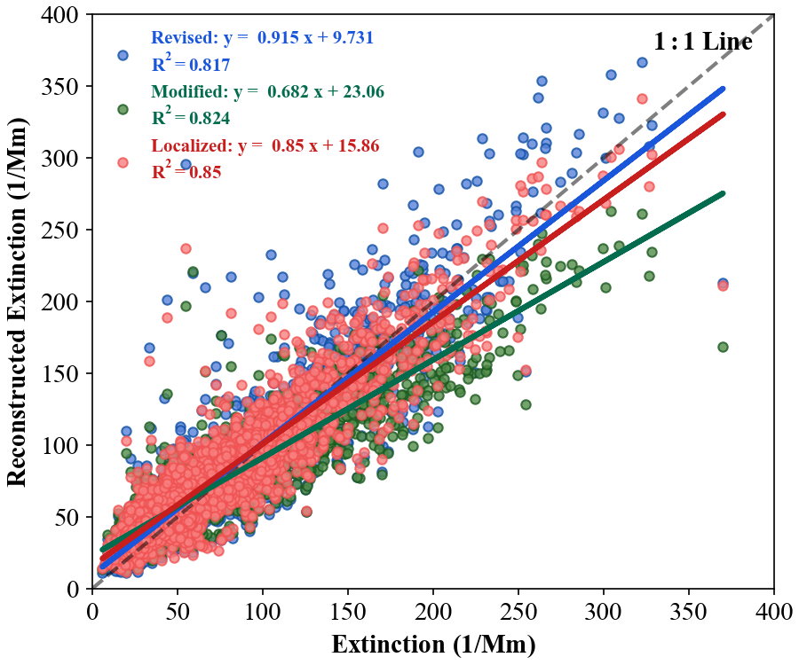
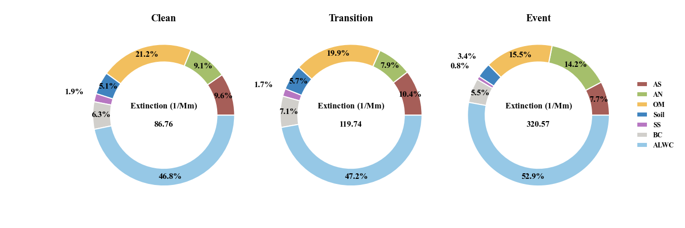
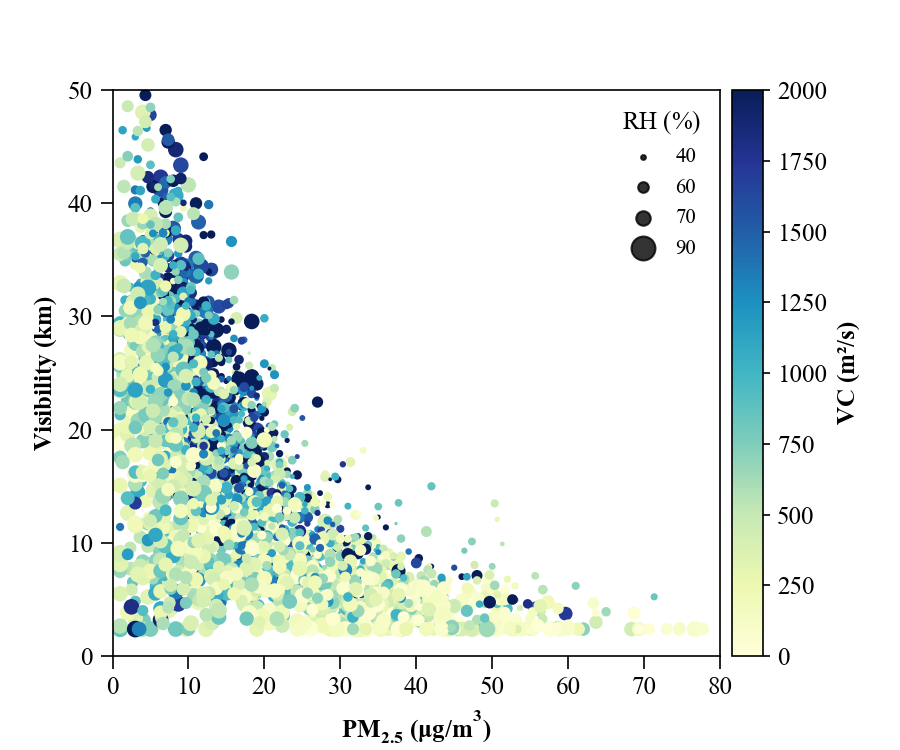
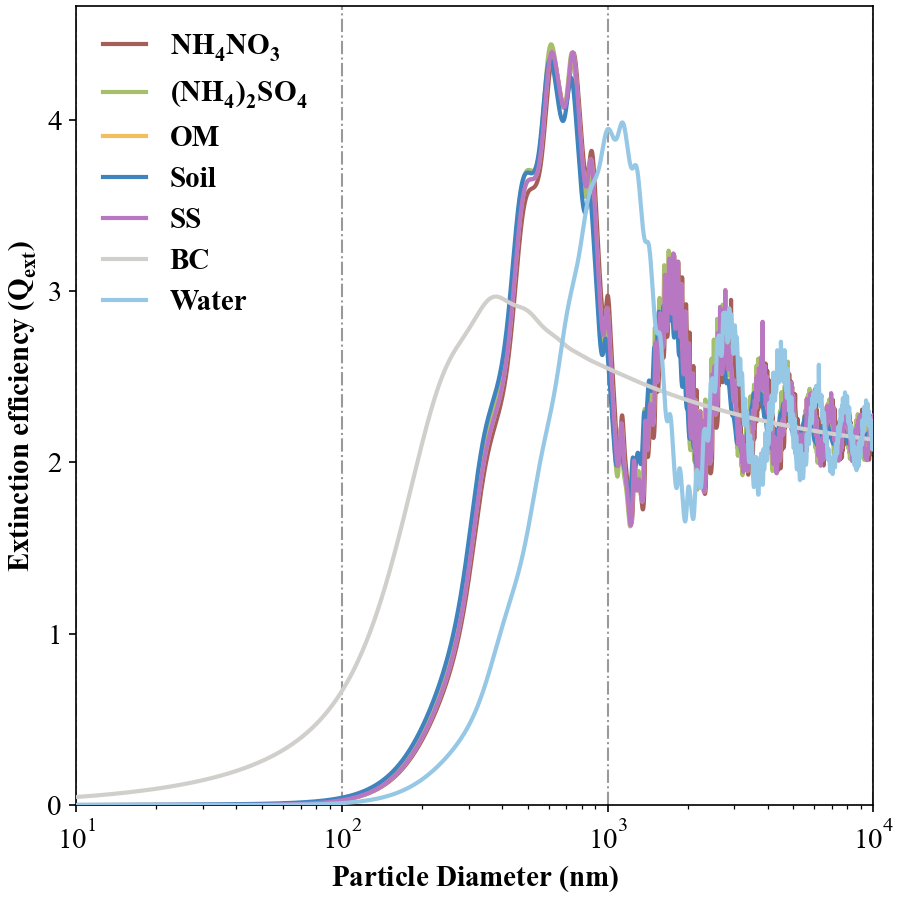
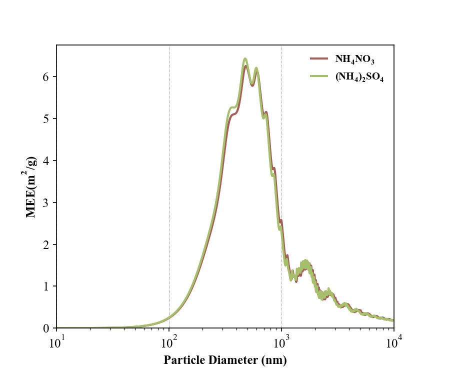

## 
DataPlot for Aerosol Science

  
  
  
  

  
  
  
  

[//]: # (> [!IMPORTANT]\)
[//]: # (> Important)

[//]: # (> [!NOTE]\)
[//]: # (> The provided code of distribution suitable for SMPS and APS data in "dX/dlogdp" unit. )

[//]: # (> It can be converted into surface area and volume distribution. At the same time, )

[//]: # (> chemical composition data can also be used to calculate particle extinction through Mie theory.)

## 
Supported Instruments

The DataPlot project currently supports data from the following instruments:

- **SMPS (Scanning Mobility Particle Sizer)**
- **APS (Aerodynamic Particle Sizer)**
- **GRIMM (GRIMM Aerosol Technik)**
- **TEOM (Continuous Ambient Particulate Monitor)**
- **NEPH (Nephelometer)**
- **Aurora (Nephelometer)**
- **AE33 (Aethalometer Model 33)**
- **AE43 (Aethalometer Model 43)**
- **BC1054 (Black Carbon Monitor 1054)**
- **MA350 (MicroAeth MA350)**
- **OCEC (Organic Carbon Elemental Carbon Analyzer)**
- **IGAC (In-situ Gas and Aerosol Compositions monitor)**
- **VOC (Volatile Organic Compounds Monitor)**

> [!NOTE]\
> We are continuously working to support more instruments. Please check back for updates or contribute to our project on
> GitHub.

## 
Visual Example

## 
WindRose

## 
Conditional Bivariate Probability Function (CBPF)

## 
For Particle Size Distribution

## 
For some basic plot

|                **Three_dimension**                 |                **Correlation Matrix**                |         **Mutiply Linear Regression**         |
|:--------------------------------------------------:|:----------------------------------------------------:|:---------------------------------------------:|
|                 |  |  |
|                  **Pie & Donut**                   |                      **Dounts**                      |                  **Scatter**                  |
|  |      |          |

## 
For "PyMieScatt"

|             **Mie_Q**             |              **Mie_MEE**              |
|:---------------------------------:|:-------------------------------------:|
|  |  |     |

[//]: # (## 
Usage
)

[//]: # ()

[//]: # (To install the package, run)

[//]: # ()

[//]: # (    $ git clone https://github.com/Alex870521/DataPlot.git)

## 
Related Dependencies

* [PyMieScatt](https://github.com/bsumlin/PyMieScatt.git)
* [py-smps](https://github.com/quant-aq/py-smps.git)

## 
Contact

For bug reports and feature requests please visit [GitHub Issues](https://github.com/Alex870521/DataPlot/issues).

  
  
  
  

