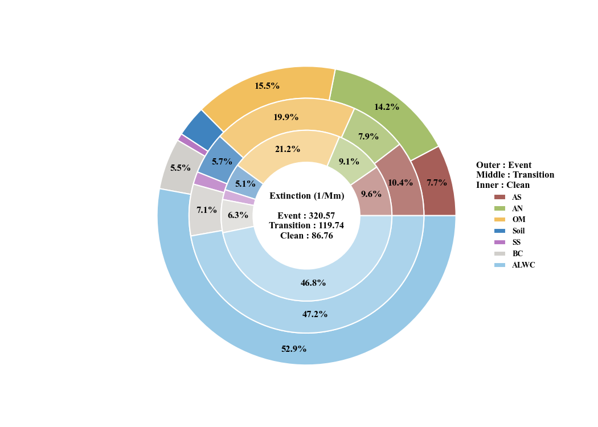
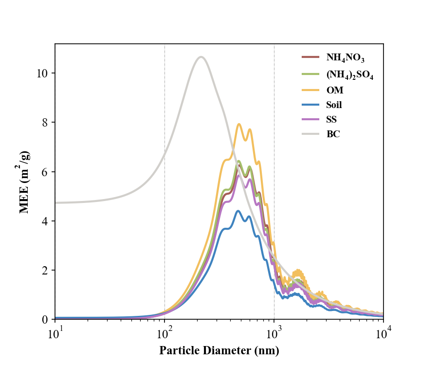

## 
DataPlot for Aerosol Science

  
  
  
  

  
  
  
  
  
  
  
  
  
  
  
  
  
  
  

[//]: # (> [!IMPORTANT]\)
[//]: # (> Important)

> [!NOTE]\
> The provided code of distribution suitable for SMPS and APS data in "dX/dlogdp" unit. 
> It can be converted into surface area and volume distribution. At the same time, 
> chemical composition data can also be used to calculate particle extinction through Mie theory.

## 
Visual Example

### 
For Particle Size Distribution

|                  **PNSD**                   |                  **PSSD**                   |                  **PVSD**                   |
|:-------------------------------------------:|:-------------------------------------------:|:-------------------------------------------:|
|      |      |      |

|               **TimeSeries**                |
|:-------------------------------------------:|
|  |
|  |
|  |

### 
For some basic plot

|                **Three_dimension**                 |                **Correlation Matrix**                |         **Mutiply Linear Regression**         |
|:--------------------------------------------------:|:----------------------------------------------------:|:---------------------------------------------:|
|                 |  |  |
|                  **Pie & Donut**                   |                      **Dounts**                      |                  **Scatter**                  |
|  |      |          |

### 
For "PyMieScatt"

|             **Mie_Q**             |              **Mie_MEE**              |
|:---------------------------------:|:-------------------------------------:|
|  |  |     |

## 
Usage

To install the package, run

    $ git clone https://github.com/Alex870521/DataPlot.git

## 
Related Dependencies

* [PyMieScatt](https://github.com/bsumlin/PyMieScatt.git)
* [py-smps](https://github.com/quant-aq/py-smps.git)

## 
Contact

For bug reports and feature requests please visit [GitHub Issues](https://github.com/Alex870521/DataPlot/issues).

  
  
  
  
  
  
  
  
  
  
  
  
  
  
  

